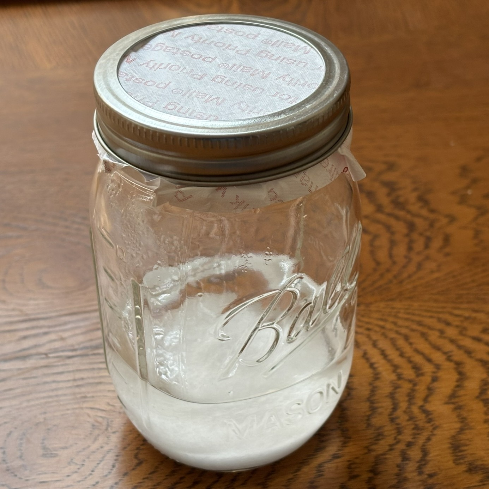
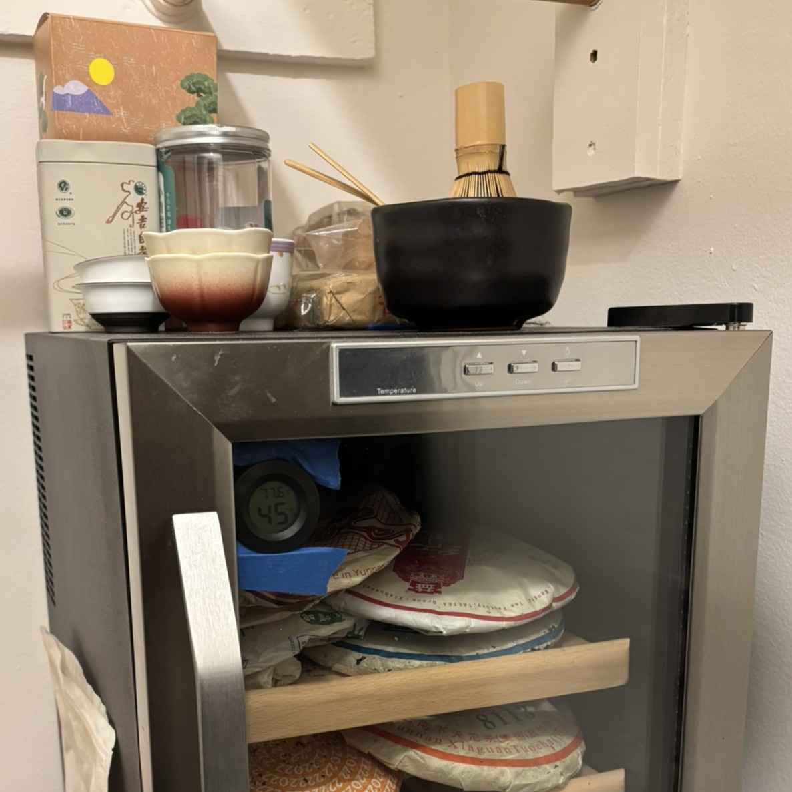
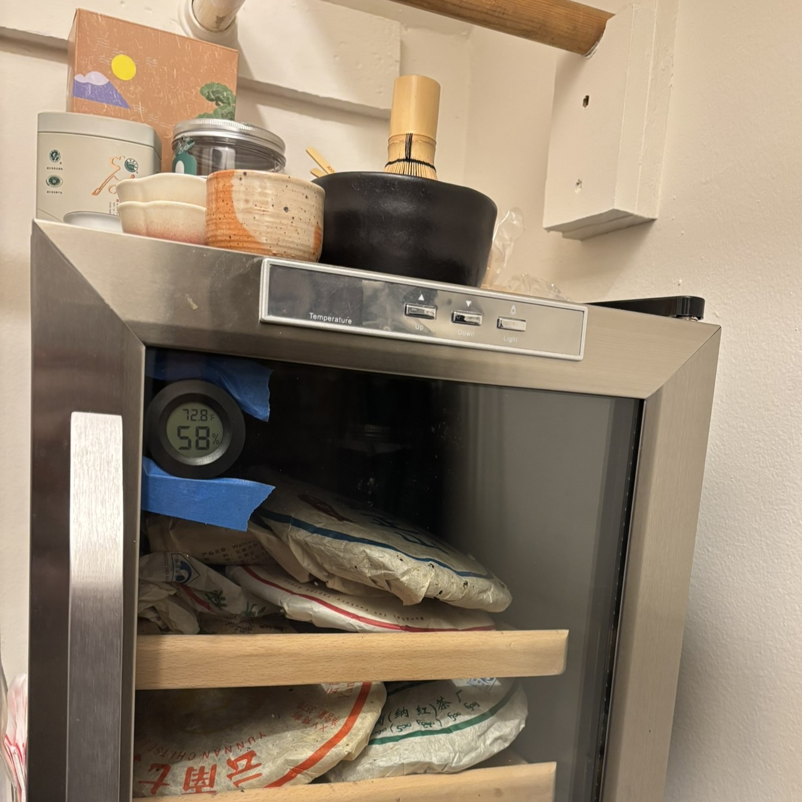
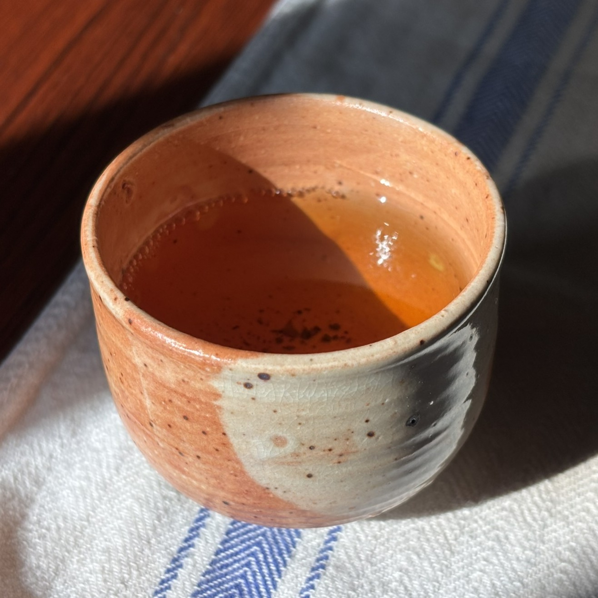

I'm in possession of a modest collection of cakes/bricks of various sorts of pressed tea; I would guess I've got somewhere around 5-6kg of the stuff.
I started acquiring these about five years ago, and my collection primarily consists of raw & ripe puer.
While I'm not at the point where I'm purchasing tea with the specific intent of aging it, it is my understanding that providing some supplemental humidity is good for the flavor of stuff you intend to drink in a relatively short order of time too.
And since I probably get through somewhere around 600g of tea a year, maybe it will take me long enough to get through my current stash that some of it will pick up a little extra age as well.

For the uninitiated, puer is an example of a "dark tea," which is the catch-all term for tea leaves that undergo some combination of microbial fermentation, enzymatic activity, and oxidation at various stages in their production process.
Some other styles include fu zhuan, which has the interesting addition of intentional growth of the fungus Eurotium cristatum on the leaves.
I have a few bricks of this as well.

Puer comes in both raw and ripe/cooked varieties, the former being in many ways similar to a green tea.
The latter undergoes a more aggressive fermentation process when first produced known as wet piling, which results in much more oxidized leaves and a very dark brew that resembles black coffee (in appearance, not at all in flavor).
I'm probably a bit partial to ripe, but I think there's much to enjoy about either option.

The idea of increasing the humidity of the tea storage is to enable this fermentation process to more easily continue, and to generally help the tea to stay "alive," in some sense of the word.
I have been meaning to work on my own storage for a while, but I only got around to setting it up a few weeks ago.

The main idea is to put the tea in some sort of insulated container - I chose a broken wine cooler[^1] I bought off of someone for $10 - along with a source of humidity.
For now, my humidity source of choice is a DIY salt-based humidity pack based on [this excellent write-up](https://www.teaforum.org/viewtopic.php?f=63&t=177) on TeaForum.
The idea is to mimic the contents of a Boveda pack or similar commercially available humidity pack, the main difference being the absence of a thickener like xanthan gum.
The presence of salt and sugar in the water serves to help maintain a water vapor equilibrium in the cooler.

Before supplementing the humidity like this, the hygrometer I placed in the cooler measured its typical relative humidity as somewhere in the 44-46% range, and sometimes lower.

I added the humidity pack about two and a half weeks ago.
Most of my tea is exposed to the humidity, but since cakes together in a closed environment tend to absorb each other's aromas, I left a few of the teas with, shall we say, stronger personalities in sealed bags.
As such, their humidity is only subject to whatever the sort of latent moisture in the tea is.

Since making this change, the relative humidity seems to hover more in the 55-58% range!
This is an exciting improvement, and certainly higher than the ambient relative humidity in my house.
Ideally it should someday get above 60%, but too much past that point I'd have to worry a little bit about mold.
It's certainly an ongoing experiment.

As an aside while we're sort of on the subject, I found a nice little cup at the 9th & 9th Street Festival last weekend that I added to my collection of teaware.
I don't recall who I got it from, but I think it's really neat!

Since ostensibly this is a math page, I suppose I should write something about math someday.
Maybe I'll get around to that later this semester.

[^1]: The reason I got a broken one is because obviously I don't want to chill the tea, so there's no reason to buy one that can be powered on.
Actually, some people experiment with _heating_ their tea storage, but I haven't gotten that adventurous yet.